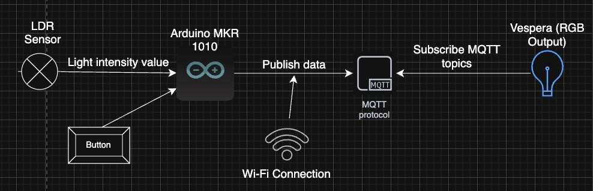
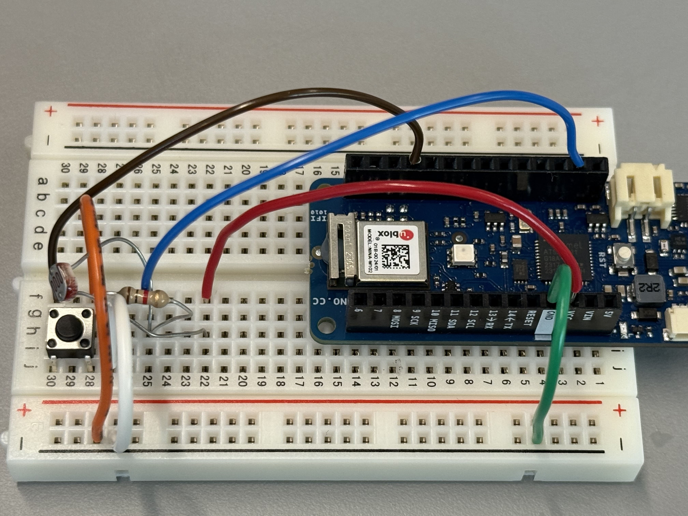
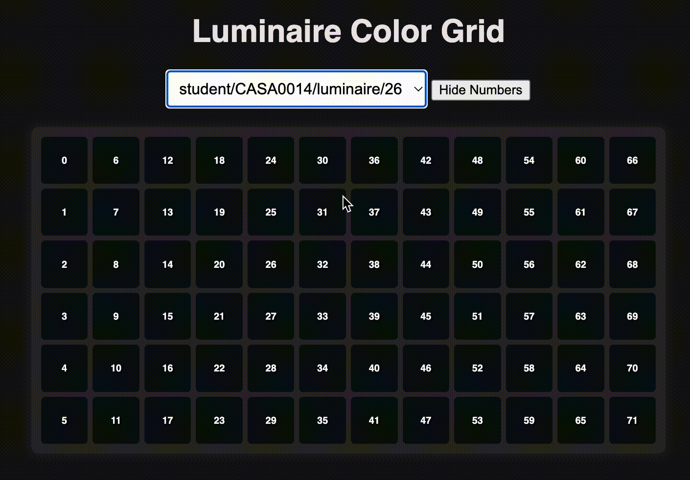
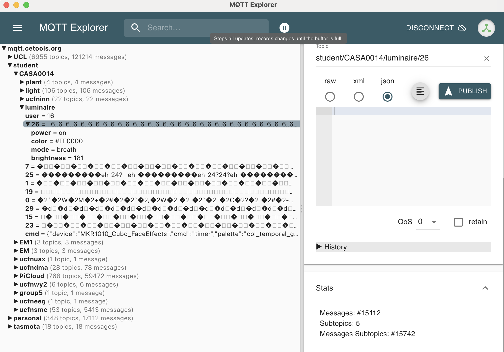

## 🌙 Vespera – Inverse Brightness Lamp 

A multi-mode IoT lighting prototype that reacts inversely to ambient brightness and can switch visual effects via button and MQTT commands.

**Author:** Lizi Wang | **Device ID:** 26 | **Platform:** Arduino MKR WiFi 1010 + MQTT  

---

## ✨ Overview

**Vespera** explores how ambient light and human interaction can shape digital behavior.  
The system **brightens in darkness** and **dims under strong light**, symbolizing balance between light and shadow.  
It can be locally controlled via a button or remotely through **MQTT topics**.

Vespera is an interactive lighting prototype that:
- Uses an **LDR** to sense ambient light;
- **Inverts** brightness (the darker it is outside, the brighter it glows);
- Supports **five lighting modes** (CCT, Rainbow, Comet, Twinkle, Breath);
- Accepts **local button control** (short press → mode switch, long press → power toggle);
- Responds to **MQTT commands** `/cmd/power` and `/cmd/mode`;
- Publishes live **status topics** `/power`, `/mode`, `/brightness`.

---

## ⚙️ System Architecture

<p align="center">
  
  <br>
  <em>System architecture showing sensors, controls, and MQTT data flow.</em>
</p>

**Core Components**
- **Arduino MKR1010** – Wi-Fi-enabled IoT controller  
- **LDR Sensor** – Measures ambient light intensity  
- **Button** – Short press = mode switch; Long press = power toggle  
- **Vespera** – Outputs brightness and color animations  
- **MQTT Broker** – Handles topic publishing and subscription  

---

## 🔌 Hardware Circuit

| Component | Pin | Notes | Description |
|------------|-----|-------|-------------|
| LDR sensor | A0  | One leg → 3.3 V, other → A0 + 10 kΩ → GND | Reads brightness level |
| 10kΩ Resistor | GND–A0 | One leg → A0, other → GND | Creates voltage divider for LDR |
| Button     | D2  | Pulled up internally, connects to GND when pressed | Switches modes and power |
| MKR1010 onboard LED | 25 (R) / 26 (G) / 27 (B) | Used for status and preview | Controls onboard RGB output |

<p align="center">
  
  <br>
  <em>Wiring diagram of the Vespera prototype.</em>
</p>

---

## 🧠 Software Logic Flow
<p align="center">
  
  <br>
  <em>Logic flowchart of sensing, processing, and communication.</em>
</p>

**Processing Steps**
1. Read LDR value (ambient brightness)  
2. Map to inverse brightness (dark → bright LED)  
3. Detect button input  
4. Render animation based on selected mode  
5. Publish RGB payload to MQTT topic  
6. Display and monitor data in MQTT Explorer  

---

## 🌍 MQTT Topic Table

| Purpose | Topic | Payload | Retained? | Direction |
|----------|--------|----------|-----------|------------|
| **Raw strip** | `student/CASA0014/luminaire/26` | 72 × 3 bytes RGB | No | → Server |
| **Brightness (state)** | `…/brightness` | 0 – 255 | No | → Server |
| **Power (state)** | `…/power` | `"on"` / `"off"` | Yes | → Server |
| **Mode (state)** | `…/mode` | `"cct"` / `"rainbow"` / `"comet"` / `"twinkle"` / `"breath"` | Yes | → Server |
| **Power command** | `…/cmd/power` | `"on"` / `"off"` | No | ← Client |
| **Mode command** | `…/cmd/mode` | `"cct"` / `"rainbow"` / `"comet"` / `"twinkle"` / `"breath"` | No | ← Client |

👉 **Command/State separation** avoids MQTT “echo loops” that cause flicker.

---

## ⚙️ Key Parameters

| Variable | Meaning | Typical Value |
|-----------|----------|----------------|
| `LDR_MIN`, `LDR_MAX` | Light range calibration | 220 – 820 |
| `GAMMA` | Perceptual brightness curve | 2.2 |
| `POWER_COOLDOWN_MS` | Anti-bounce for power toggling | 300 ms |
| `FRAME_MS` | Animation frame interval | 40 ms ≈ 25 FPS |
| `Heartbeat_ms` | State refresh period | 2000 ms |

---

## 🪄 Modes

| Mode | Description | Example |
|------|--------------|----------|
| **CCT** | Bright → cool (128,216,255), Dark → warm (255,193,128) |  |
| **Rainbow** | Flowing gradient animation |  |
| **Comet** | Moving light with fading trail |  |
| **Twinkle** | Random sparkles over dim blue |  |
| **Breath** | Soft pulsating breathing light |  |

---

## 🧩 Code Structure

```text
mkr1010_mqtt_simple
 ├── mkr1010_mqtt_simple.ino    # main program
 ├── connections.ino            # main program
 ├── RGBLED.ino                 # main program
 └── arduino_secrets.h.example  # template for credentials

Media
 └── imgs                       # wiring photos / screenshots / sketches
```
---

## 📸 Prototype Demonstration

Below are photos and screenshots showing the setup, interaction, and performance of the **Vespera inverse-brightness lamp**.

---

### 🧩 1. Prototype Overview
<p align="center">
  
  <br>
  <em>Full setup of the Vespera prototype: Arduino MKR1010, LDR sensor, button, and RGB LED connection.</em>
</p>


### 🌤 2. LDR Sensor Detail
<p align="center">
  
  <br>
  <em>Close-up of the LDR connection (A0 with 10kΩ resistor to GND). The sensor detects ambient light intensity.</em>
</p>


### 🔘 3. Button Input
<p align="center">
  
  <br>
  <em>Button used for short-press mode switching and long-press power toggle.</em>
</p>


### 💡 4. Reaction to Bright Light
<p align="center">
  
  <br>
  <em>In bright surroundings, the lamp automatically reduces its brightness.</em>
</p>


### 🌙 5. Reaction to Darkness
<p align="center">
  
  <br>
  <em>In darker environments, the lamp glows brighter – demonstrating the inverse brightness mechanism.</em>
</p>


### 🧠 6. MQTT Explorer Interface
<p align="center">
  
  <br>
  <em>MQTT Explorer showing topics like /cmd/power, /cmd/mode, and live payload updates.</em>
</p>


### 💻 7. Serial Monitor Output
<p align="center">
  
  <br>
  <em>Serial Monitor confirming Wi-Fi and MQTT connections, and publishing payload logs.</em>
</p>


### 👩‍💻 8. Demonstration
<p align="center">
  
  <br>
  <em>Demonstration of the lamp reacting to ambient light during the prototype showcase.</em>
</p>

---

## 🧪 Results
- Inverse-brightness mechanism works as expected  
- Real-time updates visible in MQTT Explorer  
- All modes render distinct visual behaviour  
- Average response time ≈ 100 ms  
- Prototype runs stably for > 10 minutes  

---

## 🚀 Future Improvements
- Develop **adaptive brightness learning** — allow the lamp to learn user preferences over time.  
- Implement **gesture-based or proximity interaction** for touch-free control.  
- Create a **web dashboard** showing real-time brightness and historical trends using MQTT + D3.js.  
- Add **sound-reactive mode**, making the lamp respond to ambient music.  
- Build a **3D-printed biophilic shell** inspired by natural light patterns.  


---

## 🧩 How to Run
### 1️⃣ Hardware Setup
1. Connect LDR to A0 with 10 kΩ resistor to GND  
2. Connect button between D2 and GND   
3. Power via USB  

### 2️⃣ Configure Wi-Fi Credentials
In `arduino_secrets.h` add:
```cpp
#define SECRET_SSID "your_wifi_name"
#define SECRET_PASS "your_wifi_password"
#define SECRET_SSID1 ""
#define SECRET_PASS1 ""
#define SECRET_MQTTUSER "student"
#define SECRET_MQTTPASS "password"
```

### 3️⃣ Upload Code
1. Open the `.ino` sketch in **Arduino IDE**  
2. Select **Arduino MKR WiFi 1010** as the board  
3. Click **Verify** (compile)  
4. Click **Upload** to flash the code to your device  


### 4️⃣ Connect to MQTT Broker
- **Broker:** `mqtt.cetools.org`  
- **Port:** `1884`  
- Open **MQTT Explorer** (or another MQTT client)  
- Subscribe to:


### 5️⃣ Test Interaction
| Action | Effect |
|--------|---------|
| Cover LDR | Lamp brightens |
| Expose LDR | Lamp dims |
| Short press | Change lighting mode |
| Long press | Toggle power (on/off) |

---

## 👩‍🔧 Technical Summary
| Category | Technology |
|-----------|-------------|
| Controller | Arduino MKR1010 |
| Language | C++ (Arduino) |
| Networking | Wi-Fi via WiFiNINA |
| Communication | MQTT Explorer |
| Visualization | Vespera |
| Power | USB 3.3 V |

---

## 📘 License
Project for **UCL CASA0014 – Internet of Things (2025)**  
© 2025 **Lizi Wang** All rights reserved.  
Educational use only.
